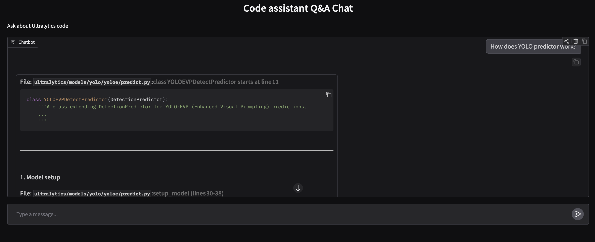

# How to run?
- Clone this repo
- Setup 'uv' environment
- Call 'uv sync'
- Run 'uv run python src/main.py'
- Go to Gradio link ([current one](https://2604da705605f47697.gradio.live/))

# Design:
RAG: retrieval with MongoDB and embedding model and generation with OpenRouter model
For embedding I used overlapping chunking to not lost data.

# How I selected models:

- For embeddings I selected 'Qwen/Qwen3-Embedding-0.6B':

I used [leaderboard](https://huggingface.co/spaces/mteb/leaderboard) to find the best one by criterias: Code embeddings with less than 1B models size to run on CPU.

- For answer generation I selected 'nvidia/nemotron-3-nano-30b-a3b:free', because it's the best model from reliable free models on OpenRouter.

# Future work:
- Support more languages for questions
- Add text-based search (BM25-based for example) and combine it with vector search
- Add cross-encoders to reranking before answer generation
- Add Map-Reduce+Batching/Ray Data for data processing or similar big data techniques
- Some UI enhancements
- Add several steps in LLM generation, e.g. tool call to get different code, prompt enhancement (trade-off between quality and tokens usage)
- Use full chat for getting more accurate request
- For scaling, I'd use Ray Serve